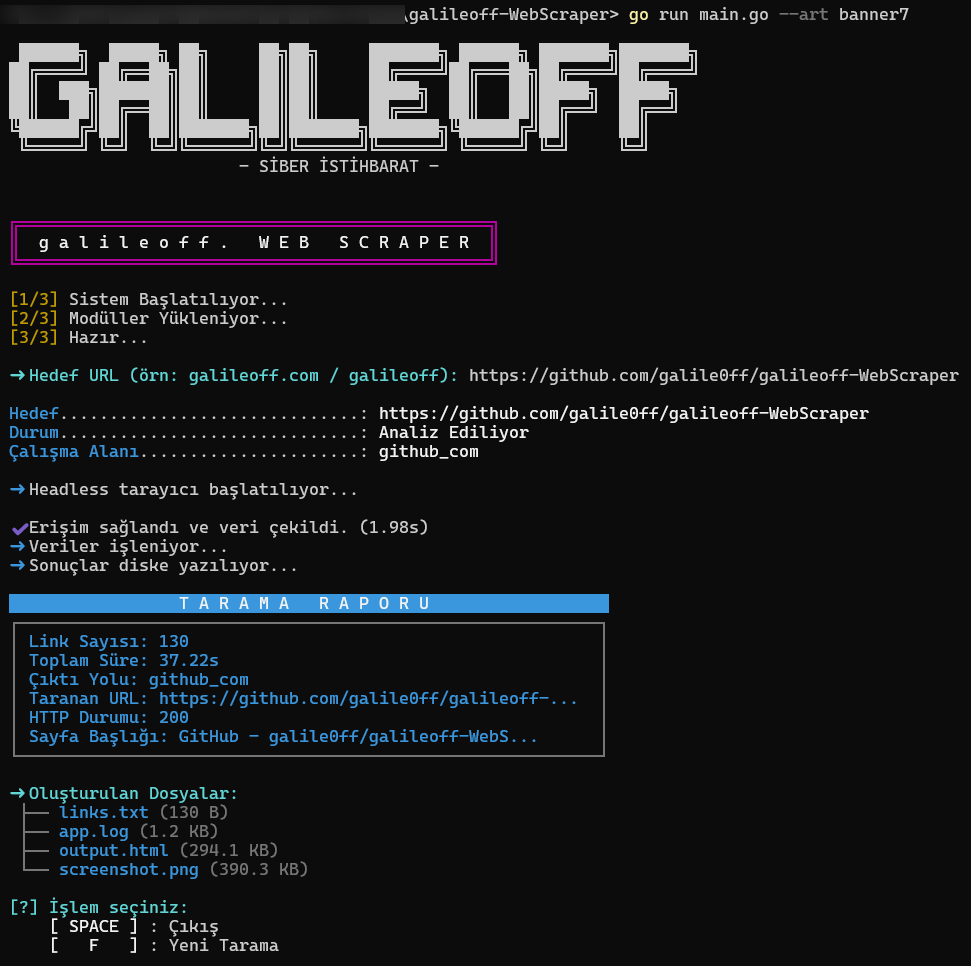

<div align="center">



# 🕷️ galileoff-WebScraper


**Modern, Hızlı ve Güçlü Web Kazıma Aracı**

*Siber Vatan Programı Yıldız CTI Ekibi görevi kapsamında geliştirilmiştir.*

[Özellikler](#-özellikler) • [Kurulum](#-kurulum) • [Kullanım](#-kullanım) • [Yapı](#-proje-yapısı) • [İletişim](#-destek)

</div>

---

## 📖 Hakkında

**galileoff-WebScraper**, Go ekosisteminin gücünü kullanarak modern web sitelerini analiz etmek için tasarlanmış profesyonel bir araçtır. Standart HTTP isteklerinin yetersiz kaldığı durumlarda, **Chromedp** altyapısı sayesinde gerçek bir tarayıcı (headless) gibi davranarak JavaScript ile render edilen dinamik içerikleri sorunsuz bir şekilde yakalar.

Araç, sadece veri çekmekle kalmaz; hedef sitenin o anki görüntüsünü yüksek çözünürlükte kaydeder ve site üzerindeki tüm ağ haritasını (link yapısını) çıkarır.

## ✨ Özellikler

| Özellik | Açıklama |
| :--- | :--- |
| **🔍 Headless Scraping** | JS tabanlı siteleri (SPA, React, Vue vb.) eksiksiz tarama yeteneği. |
| **📸 Akıllı Screenshot** | Sayfanın tam boyutlu ekran görüntüsünü otomatik olarak yakalar ve PNG olarak kaydeder. |
| **🌐 Link Extractor** | Sayfa içindeki tüm iç ve dış bağlantıları ayrıştırır ve listeler. |
| **💾 HTML Dump** | Sayfanın son render edilmiş DOM yapısını HTML dosyası olarak saklar. |
| **🛡️ Güvenli Mod** | `Graceful Shutdown` özelliği ile işlemler yarıda kesilse bile verileri korur. |
| **🎨 Cyberpunk CLI** | Mizahi, ASCII sanatlı, modern ve kullanıcı dostu terminal arayüzü. |

## 🛠 Kurulum

### Ön Gereksinimler
- **Go**: v1.23 veya üzeri
- **Tarayıcı**: Google Chrome, Chromium veya MS Edge yüklü olmalıdır.

### Hızlı Kurulum

# 1. Projeyi klonlayın
```bash
git clone https://github.com/galile0ff/galileoff-WebScraper.git
```
# 2. Proje dizinine girin
```bash
cd galileoff-WebScraper
```
# 3. Bağımlılıkları yükleyin
```bash
go mod tidy
```

## 🚀 Kullanım

Projeyi başlatmak için:

```bash
go run main.go
```

### 🎮 Kontroller

Program interaktif bir menüye sahiptir:

- **Başlangıç**: Hedef URL'yi girin (örn: `galileoff.com`)
- **`F` Tuşu**: Yeni bir tarama başlatır.
- **`SPACE` Tuşu**: Programdan güvenli çıkış yapar.

### 📂 Çıktı Örneği

Her tarama için `domain_adi_com` formatında otomatik bir klasör oluşturulur:

```text
galileoff_com/
├── app.log          # Detaylı işlem kayıtları
├── output.html      # Sayfanın kaynak kodları
├── screenshot.png   # Sitenin ekran görüntüsü
└── links.txt        # Bulunan tüm bağlantılar
```

## 🏗 Proje Yapısı

```bash
.
├── 📂 pkg/             # Ana kütüphane dosyaları
│   ├── 📂 cli/         # CLI arayüz ve ASCII tasarımları
│   │   ├── ascii.go    # ASCII sanat ve renk fonksiyonları
│   │   └── flags.go    # CLI argüman yönetimi
│   ├── logger.go       # Loglama mekanizması
│   ├── scraper.go      # Web scraping motoru (Chromedp)
│   └── utils.go        # Yardımcı dosya işlemleri
├── .gitignore          # Git ayarları
├── main.go             # Uygulama ana giriş noktası
├── go.mod              # Go modül tanımları
├── go.sum              # Bağımlılık sağlama
├── LICENSE             # Lisans dosyası
└── README.md           # Proje dokümantasyonu
```

## ☕ Destek

Bu proje açık kaynaklıdır ve geliştirilmesi zaman almaktadır. Eğer işinize yaradıysa ve destek olmak isterseniz:

<div align="center">
<a href="https://www.buymeacoffee.com/galile0ff" target="_blank">

</a>
</div>

## 🤝 Katkıda Bulunma

Açık kaynağa katkılarınızı bekliyoruz!

1. Bu repoyu fork'layın.
2. Yeni bir özellik dalı (branch) oluşturun (`git checkout -b ozellik/mükemmelozellik`).
3. Değişikliklerinizi yapın ve commit'leyin (`git commit -m 'Mükemmel ozellik eklendi'`).
4. Dalınızı push'layın (`git push origin ozellik/mükemmelozellik`).
5. Bir **Pull Request** (PR) oluşturun.

## 📈 Proje Grafiği

## Star History

<a href="https://www.star-history.com/#galile0ff/galileoff-WebScraper&type=date&legend=top-left">
 <picture>
   <source media="(prefers-color-scheme: dark)" srcset="https://api.star-history.com/svg?repos=galile0ff/galileoff-WebScraper&type=date&theme=dark&legend=top-left" />
   <source media="(prefers-color-scheme: light)" srcset="https://api.star-history.com/svg?repos=galile0ff/galileoff-WebScraper&type=date&legend=top-left" />
   
 </picture>
</a>
## 📄 Lisans

Bu yazılım **MIT Lisansı** ile lisanslanmıştır. Daha fazla bilgi için [LICENSE](LICENSE) dosyasına göz atabilirsiniz.

---

<div align="center">
Developed with ☕ by <a href="https://github.com/galile0ff">galile0ff</a>
</div>
